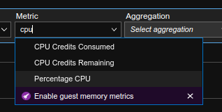
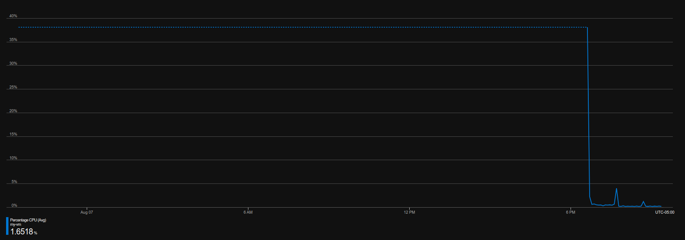

# Azure Monitor alarms

---------------------------------------------------------

## Requirements
- Microsoft Azure Account (with funds or credits)
- Microsoft Azure Suscription
- A web browser
- Access to internet
- A phone number or an email address (recommended)

---------------------------------------------------------

## Instructions
#### 1. Go to the [Azure Portal](portal.azure.com)
#### 2. Click on the searchbar at the top of the page and look for the *Virtual machines* option, then click on it.

#### 3. Click *Create* and then *Azure virtual machine*.

#### 4. Select your subscription and resource group. In my case, I'll be creating a new resource group. 

#### 5. Configure your VM's name, region and operating system. If you choose Windows as I did, you will also need to configure and administrator username and password.

#### 6. If you chose Windows as your operating system you will also need to check the licensing checkmark at the bottom of the *Basics* tab.

#### 7. Click *Review + create*.

#### 8. If validation passed, click *Create*.

#### 9. Deployment will begin, please wait a couple of seconds for it to complete.

#### 10. Once deployment has finished, click *Go to resource*.

#### 11. Click *Connect* and then *RDP*.

#### 12. Click *Download RDP File* and keep it somewhere safe.

#### 13. Now click on the searchbar again and look for *Monitor*.

#### 14. Click on *Metrics*

#### 15. Click on your resource group's arrow and then select your virtual machine. Then, click *Apply*.

#### 16. Inside the *Metric* dropdown menu, select *Percentage CPU*. You will then see a graph with your VM's CPU usage.

#### 17. Click on *Alerts*.

#### 18. Click *Create* and then *Alert rule*.

#### 19. Inside the *Filter by resource type* dropdown menu, lok for *Virtual machines* and click on it.

#### 20. Click on your VM, then, click *Done*.

#### 21. Click *Condition*.

#### 22. Inside the searchbar, look for *Percentage CPU* and click it.

#### 23. Scroll down and set the following parameters:

#### 24. Click *Done*..
#### 25. Click *Details*.

#### 26. Give your alert a name.

#### 27. Click *Review + create*.

#### 28. If validation passed, click *Create*.

#### 29. Now we will configure a way to receive notifications when the alert triggers. Click *Alert rules*.

#### 30. Click on the alert you just created.

#### 31. Click *Select action groups* and then *Create action group*.

#### 32. Select your subscription and give it a name.

#### 33. Click *Notifications*.

#### 34. Select the notification type and give it a name.

#### 35. Configure your notification destination. When you're done, click *OK*.

#### 36. Click *Review + create*.

#### 37. If validation passed, click *Create*.

#### 38. Click *Save*.

#### 39. Because I chose SMS, I got a message in my phone confirming that the notification service is active.

#### 40. We will now connect to your VM in order to try stress it. To do so, you will need an application such a remote desktop application such as [Windows Remote Desktop](https://apps.microsoft.com/store/detail/9WZDNCRFJ3PS?hl=es-mx&gl=MX) to open the RDP file you downloaded during [step 12](#12-click-download-rdp-file-and-keep-it-somewhere-safe). I am using Linux, so the app I will be using to connect to my VM is called [Remmina](https://remmina.org/).
#### 41. Once you have connected and logged in succesfully to your VM, you will be inside your desktop.

#### 42. Inside your VM, open your browser and try to stress it by doing resource-heavy stuff like playing videos; the idea is to get the CPU usage over 40%.

#### 43. After some seconds or a couple of minutes, you will receive an alert on your phone, email or whatever option you chose.

---------------------------------------------------------

## Congratulations ! You've used configured an alarm with Azure Montior !
Don't forget to delete or turn off your resources when you you're done with them !